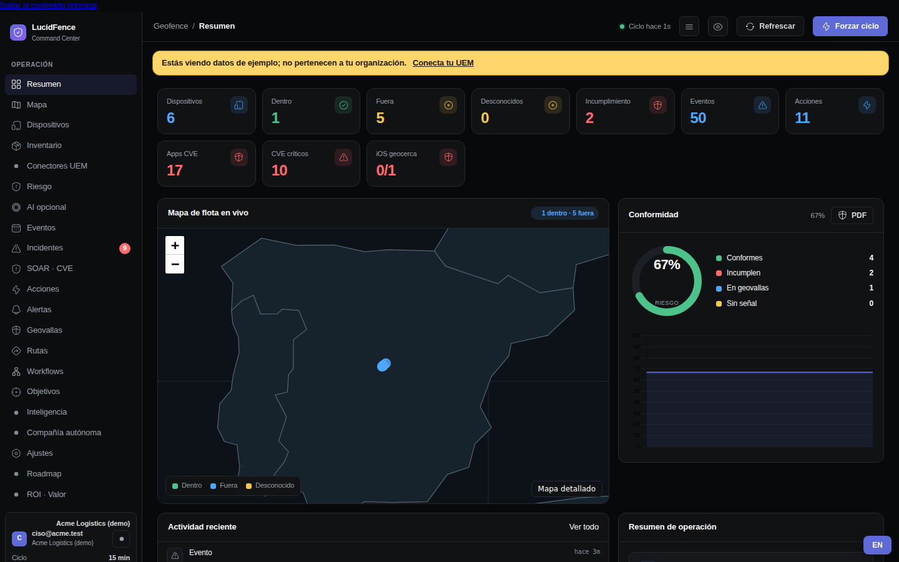
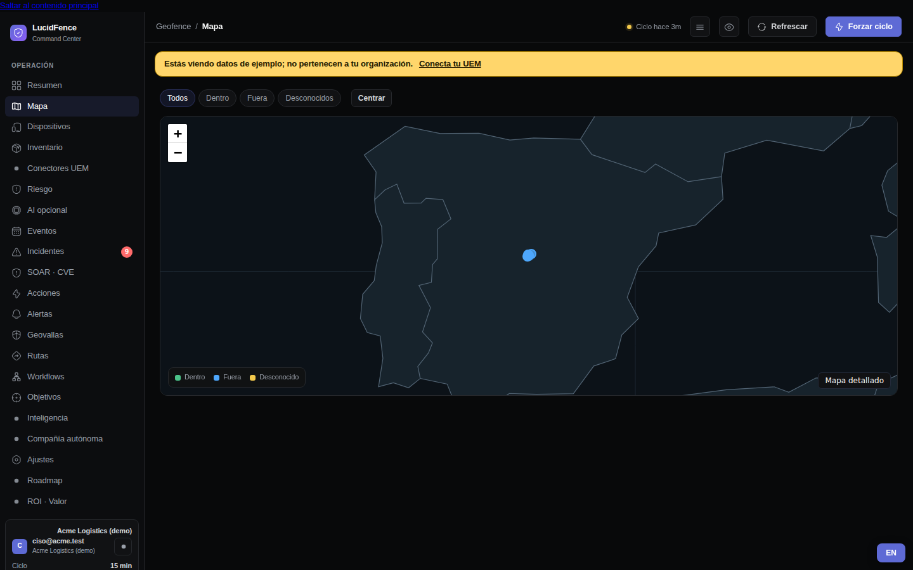
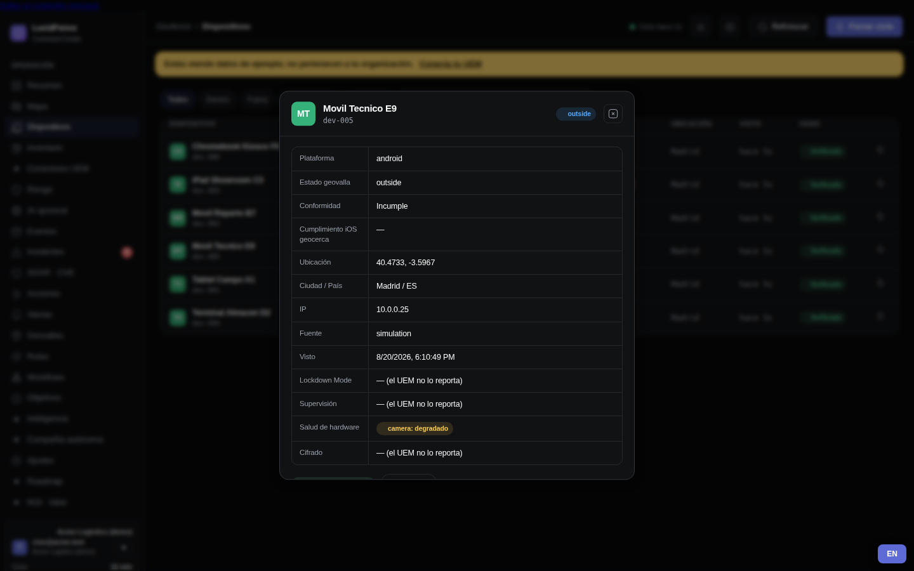
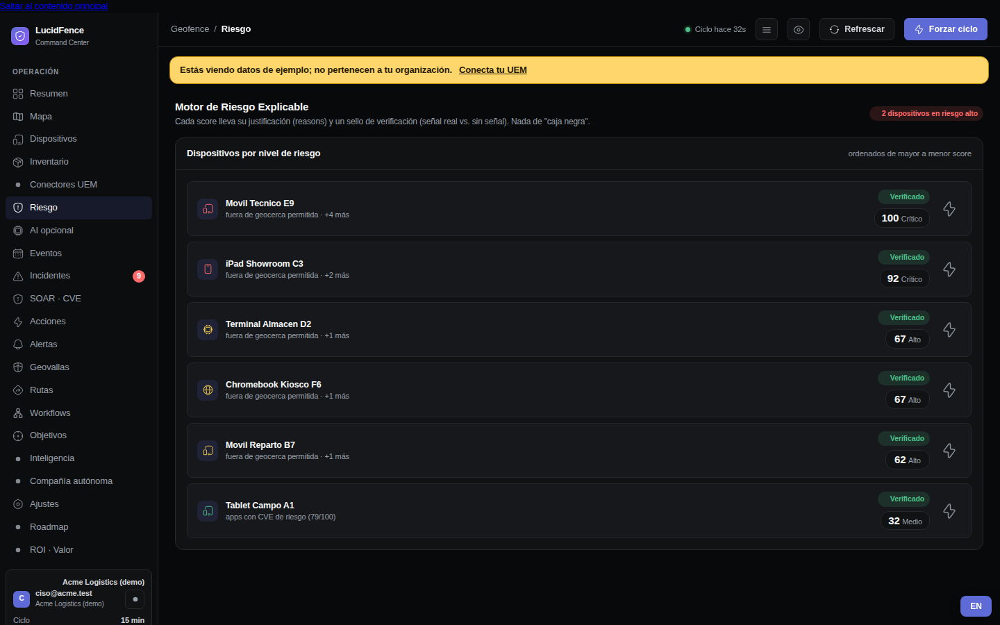
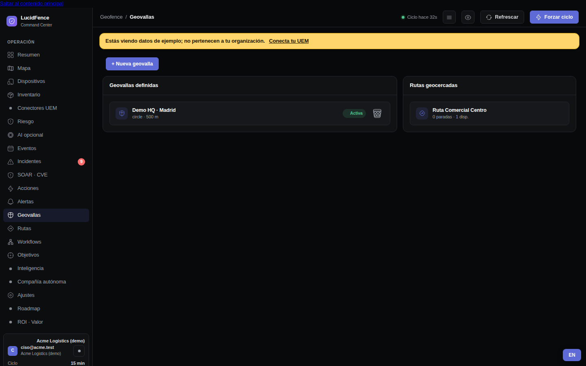
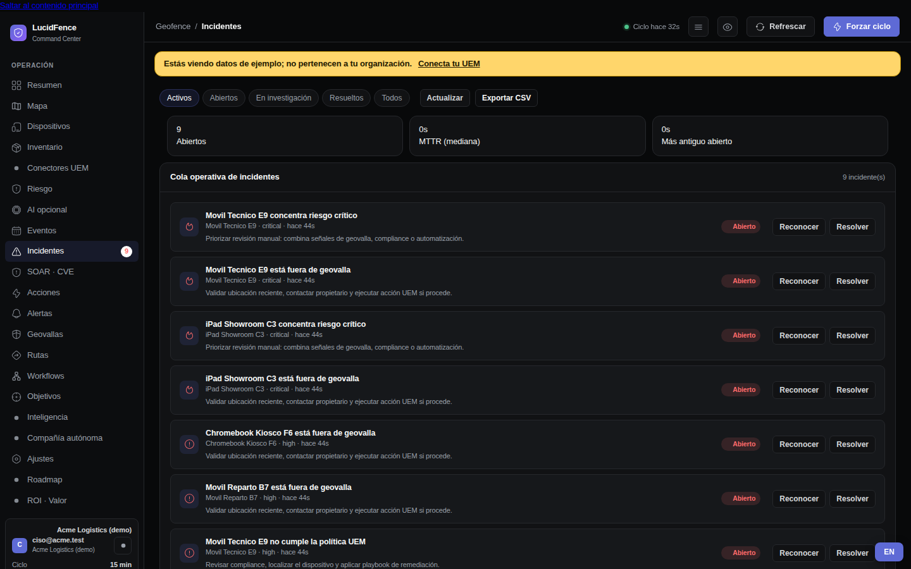
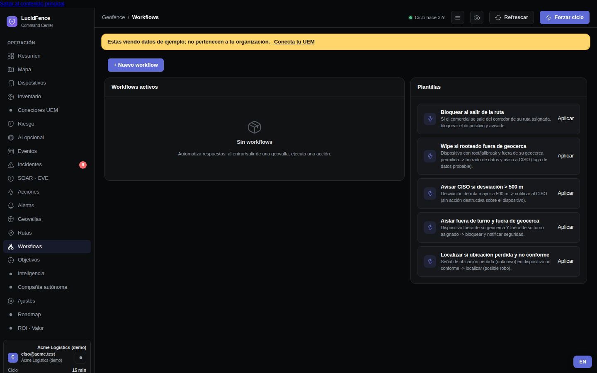
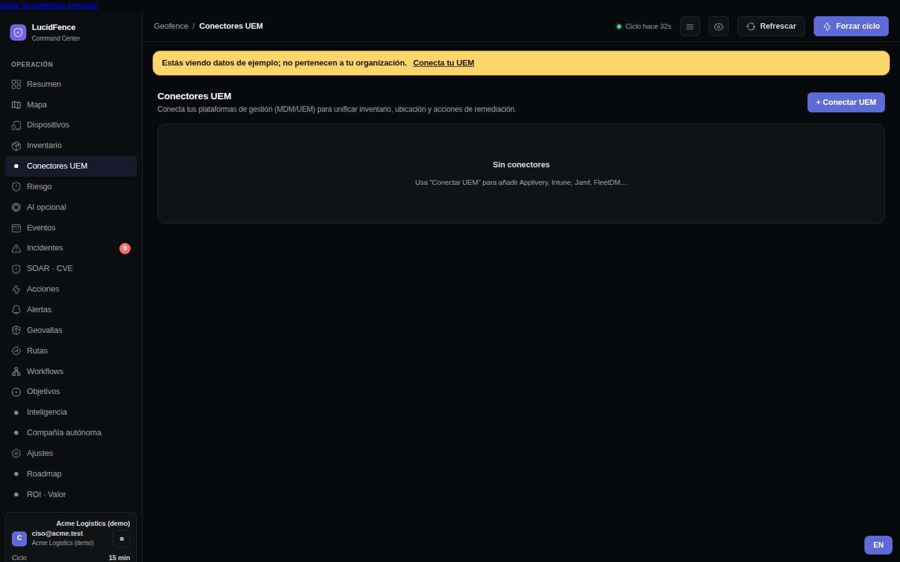
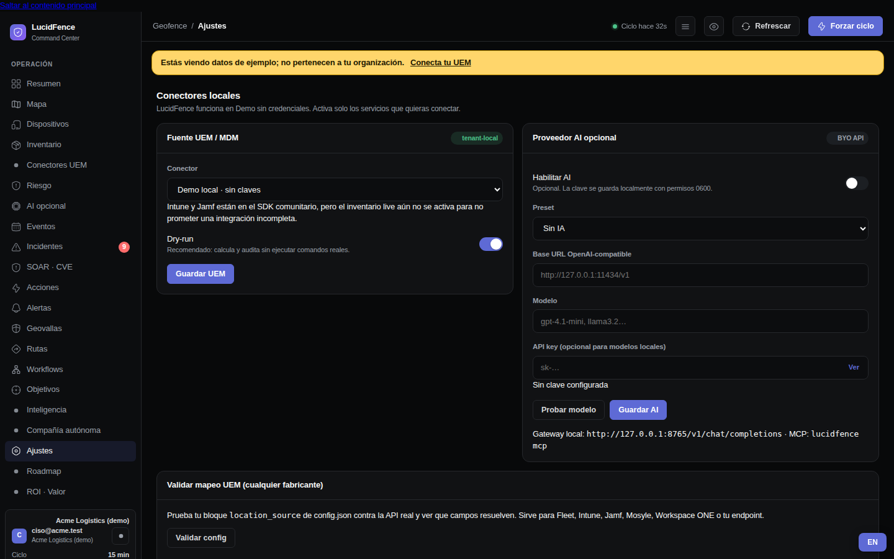

# Manual de uso de LucidFence

> Manual del usuario con capturas reales del producto (tenant demo).
> Versión interactiva paso a paso: **`/static/manual.html`** en tu instalación
> local (selector ES/EN en la cabecera), o `manual.html` en la web pública del
> proyecto. **English version:** [`USER_GUIDE.md`](USER_GUIDE.md).
> Para instalar, ver [`GETTING_STARTED.md`](../GETTING_STARTED.md).

LucidFence es el **complemento de geofencing y postura sobre el UEM que ya
tienes** (Intune, Jamf, Applivery, Fleet…): lee tu flota, correlaciona
ubicación y señales, explica el riesgo y solo actúa a través de tu UEM cuando
tú lo decides. 100% local: tus datos no salen de tu máquina.

## 1. Arrancar y entrar

```bash
lucidfence quickstart     # o: python3 saas_server.py
```

Abre `http://127.0.0.1:8765/`. Sin credenciales arranca en **modo demo** con
una flota de ejemplo (banda amarilla arriba): puedes explorarlo todo sin
riesgo, nada toca dispositivos reales.



El **Resumen** es tu pantalla de guardia: dispositivos dentro/fuera de
geovalla, incumplimientos, CVEs de apps de la flota, mapa en vivo y donut de
conformidad (exportable a PDF).

## 2. El mapa y la flota



**Mapa**: cada punto es un dispositivo, coloreado por estado (dentro / fuera /
desconocido). El botón **"Mapa detallado"** (abajo a la derecha) cambia a un
fondo real de OpenStreetMap, estilo Google Maps — es *opt-in* con aviso: las
teselas se descargan de openstreetmap.org, que ve la zona del visor; tus
dispositivos y posiciones jamás se envían, y el defecto sigue siendo el mapa
local sin ninguna petición externa. Los portátiles sin GPS también se posicionan si configuras
red-fencing (la oficina se declara por CIDR/SSID — ver
[`NETWORK_LOCATION.md`](../integrations/NETWORK_LOCATION.md)).



**Dispositivos**: la tabla operativa. Haz clic en cualquiera para su ficha:
última posición, señales de postura (cifrado, Lockdown Mode, supervisión,
salud de hardware), apps con CVE y acciones disponibles *a través de tu UEM*.

## 3. Riesgo explicable (sin caja negra)



Cada score lleva **sus razones** ("fuera de geocerca permitida", "apps con CVE
de riesgo…") y un sello de verificación que distingue señal real de ausencia
de señal. Regla de honestidad del producto: **lo desconocido nunca penaliza**
— un dato que el UEM no reporta no inventa riesgo.

## 4. Geovallas



Crea círculos (centro + radio) o polígonos. Un dispositivo queda `dentro`,
`fuera` o `desconocido` (sin señal utilizable — nunca se adivina). Si
prefieres la config como código: mantén `fences.json` en git y aplícalo con
`lucidfence apply --fences fichero.json` (valida, enseña el diff y simula el
impacto **antes** de escribir; ver
[`config_as_code.md`](../operations/config_as_code.md)).

## 5. Incidentes y workflows



**Incidentes** recoge lo que merece atención (salidas de geovalla,
incumplimientos) con su contexto. Las alertas pueden salir por Slack, Teams,
webhook firmado o ntfy ([`ALERT_RECIPES.md`](../operations/ALERT_RECIPES.md)).



**Workflows**: automatizaciones comunes ya montadas ("si sale de la geovalla,
notifica"), o constrúyela tú con disparador + condición + acción sin tocar
JSON.

## 6. Conectar tu UEM



El asistente de **Conectores UEM** te guía por fabricante con el **mínimo
privilegio** real que necesita cada uno (en observe basta solo-lectura).
Guías por UEM en [`docs/integrations/`](../integrations/); la
[matriz de ubicación](../integrations/LOCATION_MATRIX.md) dice qué entrega de
verdad cada fabricante, sin prometer de más.

## 7. Ajustes: el control siempre es tuyo



La seguridad del rollout está diseñada para que nada actúe sin ti:

1. **`observe` (por defecto)**: todo se calcula y audita, nada se ejecuta.
   El **dry-run** viene activado.
2. **`enforce`**: solo si tú lo activas por tenant, y solo las acciones de tu
   allow-list.
3. **`wipe` exige doble llave** (`allow_wipe: true` **y** el dispositivo en
   `wipe_allowlist`). Jamás se amplía desde la interfaz.

Detalle completo en [`ENFORCEMENT.md`](../operations/ENFORCEMENT.md).

## 8. ¿Qué NO estoy viendo? (puntos ciegos)

`GET /api/coverage` (o la tarjeta correspondiente) enseña el negativo de tu
cobertura: dispositivos sin señal, dispositivos que dejaron de reportar y
geovallas vacías — visible para que tú decidas, nunca acción automática
([`coverage.md`](../operations/coverage.md)).

## Preguntas rápidas

- **¿Necesito credenciales para probarlo?** No: el modo demo es completo.
- **¿Mis datos salen de mi máquina?** No. Sin telemetría, sin nube nuestra;
  la ubicación de tu flota no abandona tu instalación.
- **¿Cuánto cuesta?** Nada: 100% free open-source (Apache-2.0).
- **¿Puede LucidFence borrar un dispositivo por su cuenta?** No: doble llave
  explícita y siempre a través de tu UEM.
- **Algo falla** → `lucidfence doctor`, y [`RUNBOOK.md`](../operations/RUNBOOK.md).
